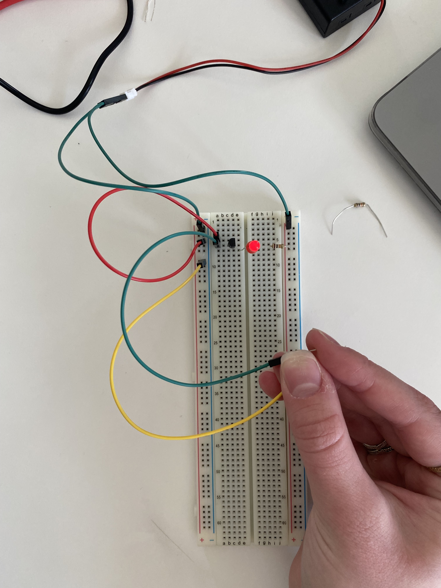
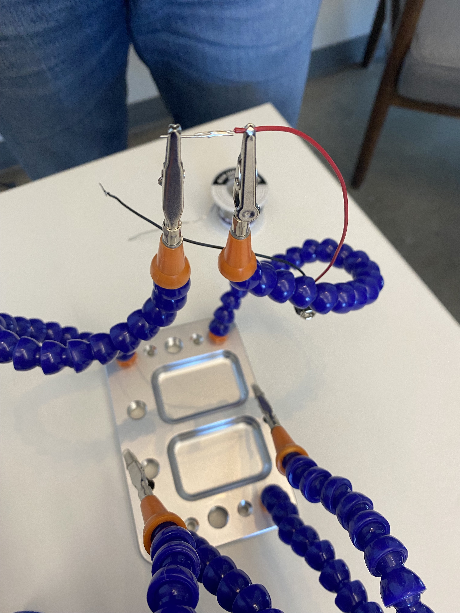
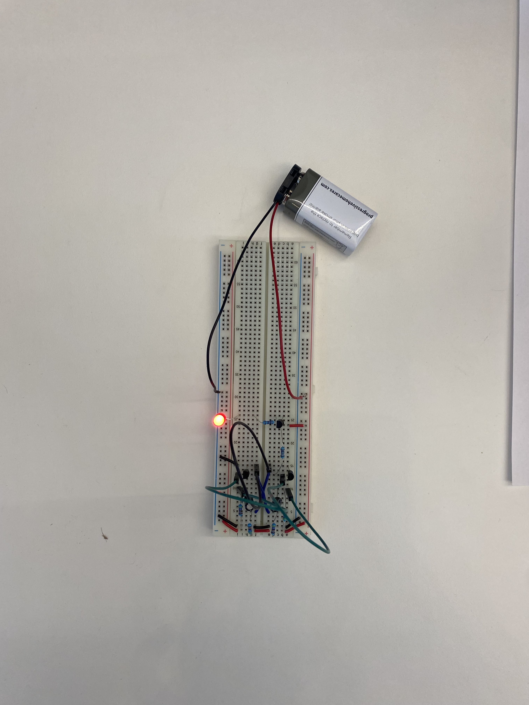

# dig333-devlog

#### Weeks: [1](#week-1) [2](#week-2) [3](#week-3) [4](#week-4) [5](#week-5) [6](#week-6) [7](#week-7) [8](#week-8) [9](#week-9) [10](#week-10) [11](#week-11) [12](#week-12) [13](#week-13) [14](#week-14) [15](#week-15)

<!--
BELOW IS A WEEKLY TEMPLATE. COPY/PASTE IT TO ADD A WEEK. SEE ASSIGNMENTS FOR DETAILS
https://docs.google.com/document/d/1PAoPz-3vDPFWS5q9RHRb-dC7T4earpFXJW8w6v9wfZ0/edit
-->

## Week 1

Summary: The Ted Talk described the physical computing as the interaction between computers and people. Computers will take inputs from people and create things for people to interact with in return.

Quote: "What they do matters less than the relationships that we make through them."

Comment: I think a big issue that will continue to grow is the debate over how much control the government, large companies, and individuals should have over technology. We need regulations to prevent harm, but we also need the opportunties for open source hardware. Technology can have consequences, so the debate is over who has control of it.

Question: What is open source hardware?

## Week 2

### Context

Article 1: [The Internet of Things: Roadmap to a Connected World](https://www.technologyreview.com/2016/03/11/108875/the-internet-of-things-roadmap-to-a-connected-world/)

Summary: The article describes the concerns and benefits of increasing connectivity with technology. The article highlights some of the main issues that we should be worried about, such as system architecture agreements and standards. The author points out that we need ask ourselves the value of these technologies.

Quote: "Today, the IoT is an abstract collection of uses and products. It’s imperative that we establish paradigms for effective implementation and use."

Comment: I understand the author's point, but I worry that if we create too many universal standards that we will lose individuality and ownership of our own private spaces on the internet and in our gadgets.

Question: How would we ever even decide the most effective way to create a universal connection system?

Article 2: [The Internet of Things had a dirty little secret: its not really yours](https://www.theverge.com/circuitbreaker/2016/7/12/12159766/internet-of-things-iot-internet-of-shit-twitter)

Summary: The article brings light to the concerns about the internet's takeover of household objects, gadgets, and things previously not connected to the online world. Targeted advertisements and short lifespans of gadgets are just a few of the issues revolving around the technology takeover. The companies that are selling the products need to make commitments to the consumers.

Quote: "My old devices were so dumb, but in hindsight, that was kind of charming. They didn’t do much, and perhaps that simplicity is really what we need."

Comment: I have many conversations about target ads with my friends, just because of how often I notice them. I think that the internet has gone too far. People are paying money for NFTs and buying property in the Metaverse where virtual reality replaces real life. While I enjoy being able to control my thermostat while I'm away from home, is coming home to a cold home really that much of an issue? There are people with a lot bigger problems in the world. I also get concerned about how much we rely on the internet. The GPS on my phone is so easy to use, but if my phone ever dies, I don't know how well I'd do with the paper map in my passenger side door.

Question: At what point does technology take over our lives instead of improving it?

### Experiments

<!-- List each Platt experiment / Monk recipe outcome, adding notes, photos, schematics, captions to show your work. -->

1. Name of the experiment
    1. Text, photos, etc.
    1. Describe the most important thing you learned (to share in class)
    1. Write a quiz question (which we will discuss in class)

1. Experiement 1: Taste the Power!
    1. We did not get to lick the batteries in class, but I work in the Makerspace, so I tried it down there. It was not as exciting as I was expecting it to be.
    2. Resistance is measured in Ohms. Conductors have low resistance and insulators have high resistance.
    3. Quiz question: How do lie detectors work?

2. Experiment 2: Let's Abuse a Battery!
    1. We also did not end up doing this experiment in class, but I've done this in my physics class before. A very important thing to remember is that short circuits are dangerous, and you should only try this with alkaline batteries, not lithium.
    2. Chemical reactions inside a battery create electrical pressure, resulting in voltage. Current is measured in amps. You can use a water analogy to understand how circuits work. Think of water in a tube with a hole in the bottom that it can leak out through. The voltage is the pressure, or the height of the water level. The amperage is the flow out of the hole. The resistance is the size of the hole. A larger hole would cause less resistance because more amperage can flow through it, and vice versa.
    3. There are two types of current. DC (direct current) is what we will be working with in the class. It flows steady in one direction. AC (alternating current) changes from positive to negative and is used to supply electricity to homes. It can be very powerful and dangerous. The charging blocks you use to plug your phone into the wall convert AC to DC current.
    4. Quiz question: What might happen if you short circuit a car battery?

3. Experiment 3: Your First Circuit
    1. 
    2. 
    3. When decoding resistors, put the silver or gild stripe all the way to the right. Silver means the value of the resistor is accurate within 10% and gold means within 5%. The second stripe from the right tells how many zeroes to add.
    4. Quiz question: What do a lot of resistors have on them that are a faster way to figure out their resistance?

4. Experiment 4: Varying the Voltage
    1. 
    2. A potentiometer is a device that can be used to adjust the resistance in a circuit. Higher resistance limits the flow of current, or amperage. Resistors in series are oriented so that one follows the other, while resistors in parallel are oriented side by side. Parallel resistors lower the resistance because the current has more paths to take while series resistors increase resistance.
    3. Ohm's law describes the relationship between amperage/current (I), voltage (V), and resistance (R). $V = IR$
    4. A watt is a unit of work, and can be found using $W = VI$
    5. Quiz question: How does a potentiometer work?

5. Experiment 5: Let's Make a battery
    1. 
    2. 
    3. Two batteries in series deliver twice the voltage, while two batteries in parallel can deliver twice the current for twice as long.
    4. Quiz question: How can you create an analogy between batteries and water tanks to explain putting batteries in series vs parallel?

## Week 3

### Context

Article 1: [The Critical Engineering Manifesto](https://criticalengineering.org/)

Summary: A critical engineer considers the importance of engineering in society and works to explore the influence and impact of engineering and its possibilities.

Quote: "The Critical Engineer recognises that each work of engineering engineers its user, proportional to that user's dependency upon it."

Comment: It is important to consider how the things that we engineer also engineer us. When we become dependent on the things that we have engineered, we are just products of our own products. For example. GPS systems were created by humans to help us more easily navigate. Now, however, many people rely on their GPS and cannot get around without it, becoming dependent users.

Question: What is the most concerning problems today when it comes to critical engineering?

Article 2: [Artist Profile: Julian Oliver](https://rhizome.org/editorial/2012/sep/5/artist-profile-julian-oliver/)

Summary: Julian Oliver is an artist that works in creative technology.

Quote: "I, for instance, realised early on that I didn't want to be staring at a rectangle full of little pictures other people and companies have made and so I switched to an iconless digital workspace. For many years I've started the day with a black terminal on a GNU/Linux host operating system. That is my blank canvas. I work with software, not software products."

Comment: I really like how Julian highlights the way he interacts with technology in a way to use it as a tool for his own creation, rather than becoming a user of software products. This connects to the Critical Engineering Manifesto in that we have become consumers of software products, rather than creators that use software as a tool.

Question: How do art and engineering interact with digital technology and art?

## Week 4

### Context

Article 1: [Pay for the Printer (1956)](https://owenmundy.com/teaching/docs/Dick,%20Philip%20K.%20-%20Pay%20for%20the%20Printer%20(1956).pdf)

Summary: In a desolate world following nuclear war, everything is being printed; it is being reproduced, not built. The characters have realized that the printers are dying, and the quality of the products being printed has drastically fallen. To conclude the story, one of the characters explain that he has built something himself, and that should be the way of the future.

Quote: ""We'll keep it -- not to copy, but as a model, as a goal. You can't grasp the difference now, but you will."

Comment: The story brings attention to the problem of mass production. During the 1950s, the Cold War and the idea of nuclear warfare was an extreme concern around the globe, and the idea of technology becoming both a weapon and the only source of production was alarming. The issue in the story highlights how continuously replicating and copying other products will eventually cause the quality to go down, and people will lose their ability to engineer tools, products, and machines on their own.

Question: Today, we are 3D printing houses. How do you think the quality of production and the human creativity that is involved in architecture will change in the near future?

Article 2: [The Preserving Machine (1953)](https://owenmundy.com/teaching/docs/Dick,%20Philip%20K.%20-%20The%20Preserving%20Machine%20(1953).pdf)

Summary: A doctor wishes to preserve music in the wake of warfare, out of fear of destruction of the records. He has a machine that will turn music into a living animal, which he then releases into a forest behind his house. However, the animals evolve, and when he turns them back into music again, it is not the same.

Quote: ""Even though this method failed, some other may work; something that we can't foresee or predict now may come along, some day."

Comment: Because this story was written during the same time period as the other story, it can be seen that a great concern of the time was destruction of things due to nuclear war, as the Cold War was happening at the time. Today, we preserve things through the internet, where records can live on in a digital form, yet when the story was written, there was no way to save things except for physical copies. The story also highlights how nature evolves, and that autonomous living things cannot be controlled. Today, we can control computers. However, I begin to wonder that as AI becomes increasingly intelligent, how much we will be able to control about the records that the AI stores. Just as the man's forest took on its own path and went out of control, so could the technology that we have oursevles invented for preservation.

Question: Do you think that physical copies of things or digital copies of things are a more "safe" option to keep them from being destroyed?

## Week 5

### Context

Article 1: [Everything That's Inside Your Phone](https://www.vice.com/en/article/433wyq/everything-thats-inside-your-iphone)

Summary: The article lists all the raw materials that go into an iPhone, and it discusses the ethics of their extraction.

Quote: "So, according to Michaud's calculations, producing a single iPhone requires, roughly, mining 34 kilos of ore, 100 liters of water, and 20.5 grams of cyanide."

Comment: The amount of raw materials, energy, and labor that goes into creating just the hardware of an iPhone should justify the price. The environmental impacts and the humanitarian issues of child labor and underpaid workers are concerning, considering that many consumers don't even think about what goes on at the very beginning of iPhone production.

Question: If Apple gets its materials from a place that has already mined them, who is responsible? Apple, the company they buy from, or the consumer?

Article 2: [One Man's Nearly Impossible Quest to Make a Toaster From Scratch](https://gizmodo.com/one-mans-nearly-impossible-quest-to-make-a-toaster-from-5794368)

Summary: A man decided to make a toaster straight from raw materials. He realized how much mass production and manufacturing has disconnected the product from the raw materials that go into it.

Quote: "But when he brought it home and unscrewed all the bits, he found 400 parts made of over 100 different materials. Finding every material would have extended his roughly nine month project into a life long one."

Comment: I think we, as consumers, need to be more aware of what goes into the products we use. It is very easy to buy something off of a shelf, plug it in, and not think much of it. But if we understand how the things we are using work and what goes into making them, not only will we be able to fix them ourselves, but we can appreciate what the technology has done for us and be more aware of our environmental and human effects of consuming technological goods.

Question: What is something you think would be easy to make from raw materials?

### Experiments

6. Experiment 6: Very Simple Switching
    1. 
    2. 
    3. 
    4. Stranded wires are more flexible but cannot easily be used with breadboards.
    5. Push buttons are a momentary on (SPST), aka OFF-(ON) or (ON)-OFF.
    6. Switches: toggle switches, single-pole, double throw (SPDT), aka ON-ON type
    7. SPDT: single pole double throw switch
    8. SPST: single throw switch (one direction = contact, other direction = no contact, like household light switches)
    9. Quiz Question: In schematics, is the positive side of the power supply shown at the top or bottom of the diagram?

7. Experiement 7: Relay-Driven LEDs
    1. 
    2. 
    3. Inside a relay is a coil of wire wrapped around an iron core. This is where electricity runs through the coil. The iron core exerts a magnetic force, which pulls a level, which pushes or pulls a springy strip of metal closing two conacts. Relays are categorized like switches: SPDT, DPST, SPDT, etc.
    4. Relays convert small electrical stimuli into larger currents.

8. Experiment 8: A Realy Oscillator
    1. 
    2. Farad: international unit used to measure capacitance.
    3. Capacitor: like a small rechargable battery
    4. Capacitors will pop up from breadboards, so be careful!

9. Experiement 9: Time and Capacitors
    1. 
    2. In this experiement we measured the voltage across a capacitor, and then when we touched the capacitor with a resistor, the voltage dropped to zero.
    3. Capacitors don't charge at a constant rate. Volts accumulate slower and slower. Think of electrons trying to fill an auditorium; as seats fill up, it takes more time for people to find seats. 
    4. TC = R x C (TC: time constant, C: farads, R: ohms)

10. Experiment 10: Transistor Switching
    1. 
    2. Transistor: semiconductor device used to amplify or switch electrical signals and power.
    3. NPN and PNP transistors behave like pushbuttons.
    4. Don't let electricity run through body, only use one hand. At high voltage it can be very dangerous!

## Week 6

### Context

Article 1: [Igloo White](https://owenmundy.com/teaching/docs/Correll,%20John%20T.%20-%20Igloo%20White,%20Air%20Force%20Magazine,%202004.pdf)

Summary: During the Vietnam War, sensors were installed across a military line to detect movement across it. The military wanted to just hold the line, not invade Northern Vietnam. While this project ultimately was not successful, it made progress in military technology and developed new thoughts about replacing soldiers with technological sensors.

Quote: "Igloo White consisted of three
parts: the sensors, the orbiting aircraft to relay the signal, and the Infiltration Surveillance Center at Nakhon Phanom Air Base in Thailand."

Comment: The article made me think about how much technology that we use in every day life started out as military technology. A lot of our daily devices came about because they were intended for military surveillance. 

Question: Do you think there is a possibility of just having a technological war? How would the victor of a cyberwar be determined?

Article 2: [Unseen Sensors: Constantly Sensing but Rarely Seen](https://owenmundy.com/teaching/docs/Nissen%20-%20Unseen%20Sensors%20Constantly%20Sensing%20but%20Rarely%20Seen.pdf)

Summary: In NYC, there are so many sensors that are constantly taking in information, yet we rarely think about them. From traffic sensors, building security cameras, automatic door openers, automatic lights, and more, information is constantly being taken in by these sensors around us.

Quote: "Sensors are inherently of their context: the physical context they sense and the human one they often infer, but also of the corporations that manufacture
them, and the organizations that install them and base decisions on the supposedly objective data that they create."

Comment: The amount of information that is being taken in by sensors ultimately concerns me. Yes, the information is helpful for traffic patterns, safety, and accessibility, but I get concerned about when companies begin to use this information for advertisements, or if systems were to be hacked into and someone were to use facial recognition to monitor someone. Additionally, the government can use these sensors to monitor for criminals and spies, yet I wonder at what point does it become an infiltration of privacy.

Question: Should we be concerned about the data that is being sensed, or should we be more concerned about the companies that have access to this data?

### Experiments

Soldering
- make sure to use a fan
- hold solder against soldering iron in order to melt it onto wires

